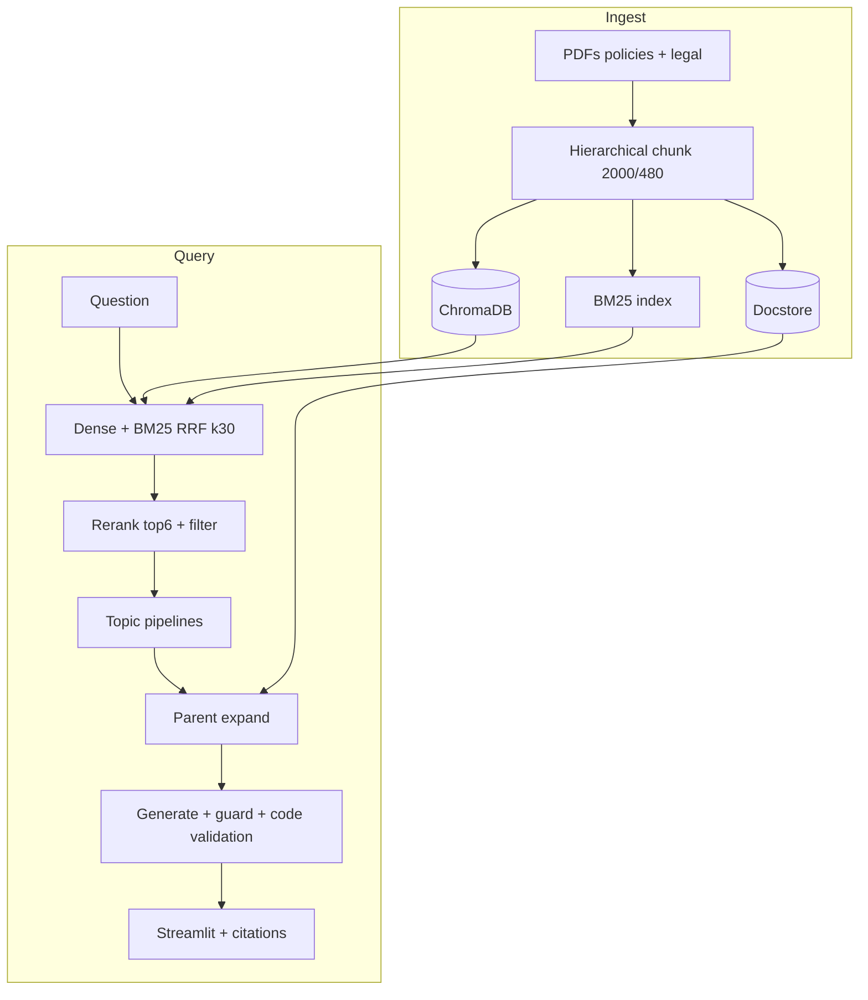

# Rag-chatbot

Production-minded **Retrieval-Augmented Generation** for company policies and the AI Agents guidebook. Local stack: **LlamaIndex 0.14+**, **Ollama**, **ChromaDB**, **Streamlit**.

Built for teams that need **grounded answers with verifiable `[Source N]` citations** — not demo RAG that hallucinates confidently.

---

## Repository layout

```
Rag-chatbot/
├── company_policy_rag/          # Application code (RAG library + Streamlit UI)
│   ├── src/                     # Core modules (retrieval, generation, eval)
│   ├── app/                     # streamlit_app.py (primary UI)
│   ├── scripts/                 # Index, evaluate, CI gates
│   ├── data/                    # PDFs + golden eval datasets
│   └── README.md                # Full setup & architecture reference
└── .github/workflows/
    ├── rag-ci.yml               # pytest + retrieval smoke gate
    ├── docker-publish-dockerhub.yml  # CD → Docker Hub
    └── pypi-publish.yml         # PyPI on version tags
```

---

## Quick start

```bash
git clone https://github.com/SoubhagyaJain/Rag-chatbot.git
cd Rag-chatbot/company_policy_rag
```

Then follow the [package README](company_policy_rag/README.md) for install, indexing, and running Streamlit.

**Docker (pre-built image):**

```bash
cd company_policy_rag
docker pull soubhagya007/rag-chatbot:latest
cp .env.docker.example .env.docker
docker compose -f docker-compose.dockerhub.yml up -d
```

Open [http://localhost:8501](http://localhost:8501). Ollama must run on the host (`qwen2.5:7b`, `nomic-embed-text`).

---

## Architecture at a glance



**308 Chroma chunks** (80 policy + 228 guidebook). Retrieval uses hybrid BM25 + dense fusion, cross-encoder reranking, topic-specific pipelines for guidebook weak cases, parent-document expansion, faithfulness guard, and code validation.

See [company_policy_rag/README.md](company_policy_rag/README.md) for the full architecture, configuration, and eval guide.

---

## CI/CD

| Workflow | Trigger | What it does |
|----------|---------|--------------|
| **RAG CI** | PR/push to `main` (`company_policy_rag/**`) | 222 pytest tests + 8-case retrieval smoke gate |
| **Docker CD** | Push to `main`, tags `v*`, manual | Build & push `soubhagya007/rag-chatbot` to Docker Hub |
| **PyPI** | Tags `v*` | Publish `soubhagya-policy-rag` |

**Latest green runs:**
- RAG CI: [#27804469869](https://github.com/SoubhagyaJain/Rag-chatbot/actions/runs/27804469869)
- Docker CD: [#27820859129](https://github.com/SoubhagyaJain/Rag-chatbot/actions/runs/27820859129) → `latest`, `main`, `sha-1fce8b5`

Docker Hub: [soubhagya007/rag-chatbot](https://hub.docker.com/r/soubhagya007/rag-chatbot)

---

## Latest metrics (golden set, balanced mode)

| Corpus | Run | Faith | Relevancy | Hit |
|--------|-----|-------|-----------|-----|
| Policy (25 cases) | `20260617_104356` | **0.807** | **0.747** | — |
| Guidebook (35 cases) | `20260619_101844` | 0.594 | **0.766** | **0.886** |

Targets: faith ≥ 0.90, relevancy ≥ 0.75. Guidebook faithfulness remains the main gap. Details in [README3](company_policy_rag/README3.md).

---

## Documentation

| Doc | Purpose |
|-----|---------|
| [company_policy_rag/README.md](company_policy_rag/README.md) | Setup, architecture, config, eval, troubleshooting |
| [company_policy_rag/README2.md](company_policy_rag/README2.md) | Engineering journey — metric regressions, fixes, lessons |
| [company_policy_rag/README3.md](company_policy_rag/README3.md) | Living status report — completion %, backlog, risks |

---

## License

MIT — use freely within your organization. Ensure compliance with document retention and privacy policies when indexing legal material.