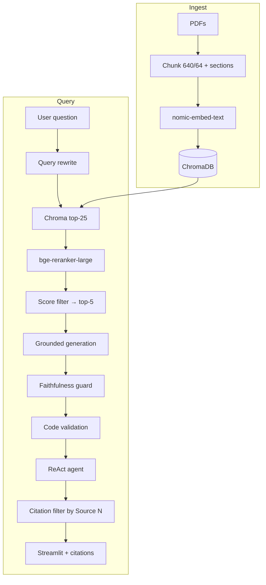

# Company Policy RAG

Production-minded **Retrieval-Augmented Generation** for company policies and legal documents. Local stack: **LlamaIndex 0.14+**, **Ollama**, **ChromaDB**, **Streamlit** (primary UI).

Built for teams that need **grounded answers with verifiable `[Source N]` citations** — not demo RAG that hallucinates confidently.

For the full engineering journey (metric regressions, fixes, lessons), see [README2.md](README2.md).  
For **progress status, validation gaps, and remaining work**, see [README3.md](README3.md).

---

## Project maturity

| Area | Status | Notes |
|------|--------|-------|
| Indexing & chunking | **Stable** | Chroma persistence, incremental indexing, section metadata |
| Retrieval + reranker | **Stable** | Over-retrieve → rerank → score filter; eval-validated |
| Faithfulness grounding | **Stable** | Strict / balanced modes + optional guard |
| Citation pipeline | **Stable** | Generation-linked sources + mandatory `[Source N]` tags |
| Streamlit UI | **Stable** | Primary internal tool; chat, sidebar, expandable citations |
| Docker deployment | **Stable** | Streamlit container + host Ollama via `host.docker.internal` |
| Evaluation framework | **Stable** | Golden set, trend logging to `logs/evaluation_results.json` |
| Hybrid BM25 retrieval | **Stable** | Dense + BM25 RRF fusion (on by default) |
| Parent-document retrieval | **Stable** | Rank on children, expand to parent context |
| Code validation (Phase 3) | **Stable** | Heuristic + LLM judge, self-correct once, low-confidence fallback |
| ACL / metadata filters | **Planned** | Hooks exist; not enforced per-user |

This is a **serious engineering baseline**, not a toy chatbot. Expect to tune on your own documents and re-run eval after every pipeline change.

---

## Table of contents

- [What it does well (and what it doesn't)](#current-state--limitations)
- [Example interactions](#example-interactions)
- [Quick start](#quick-start) (local + Docker)
- [Architecture](#architecture)
- [Evaluation](#evaluation)
- [Production considerations](#production-considerations)
- [Indexing & chunking](#indexing--chunking)
- [Retrieval pipeline](#retrieval-pipeline)
- [Faithfulness & grounding](#faithfulness--grounding)
- [Citations](#citations)
- [Configuration reference](#configuration-reference)
- [Project structure](#project-structure)
- [Roadmap & troubleshooting](#roadmap--troubleshooting)

---

## Current state & limitations

### Strengths (measured on golden set)

| Capability | Typical result | Why it matters |
|------------|----------------|----------------|
| **Context Precision** | ~0.59–0.82 (corpus-dependent) | Reranker + score filter keep noise out of the LLM context |
| **Faithfulness** | Policy **0.807**; guidebook **0.629** (`164848`) | Balanced mode; strict ~1.0 but relevancy ~0.42 |
| **Hit rate** | ~0.77–0.87 | Retrieval usually finds *something* relevant |
| **Citations** | `[Source N]` tags + section/page metadata | UI shows only sources cited in the answer |

### Known weaknesses (be honest)

- **Answer Relevancy varies** — strict grounding hit 1.0 faithfulness but ~0.42 relevancy (over-abstention). Balanced mode trades some faithfulness for usefulness; tune via eval.
- **Recall can drop with tight reranking** — high precision often means fewer chunks reach the LLM; edge cases may miss sections.
- **Document quality is everything** — scanned PDFs, missing sections, or outdated handbooks limit what any RAG stack can do.
- **Hybrid BM25 is on by default** — disable with `ENABLE_HYBRID_BM25=false` for dense-only A/B.
- **Local LLM limits** — `qwen2.5:7b` is adequate for Q&A; complex multi-document reasoning may need a larger model.
- **Latency** — reranker + query rewrite + faithfulness guard add seconds per query on CPU.

### When to use Strict vs Balanced grounding

| Mode | Use when | Trade-off |
|------|----------|-----------|
| **Balanced** (default) | Internal HR / policy Q&A | Policy faith ~0.80; guidebook faith ~0.63 — tune via eval |
| **Strict** | Compliance review, legal audit trails | Faithfulness ~1.0, more abstention |

```bash
# Balanced (default)
GROUNDING_STRICTNESS=balanced
FAITHFULNESS_GUARD_MODE=balanced

# Strict
GROUNDING_STRICTNESS=strict
FAITHFULNESS_GUARD_MODE=strict
STRICT_GROUNDING=true
```

---

## Example interactions

### Good answer (grounded + cited)

**User:** *What is the policy on vacation accrual for full-time employees?*

**Assistant:**
> Based on the available information, full-time employees accrue vacation by years of service: 3.077 hours biweekly (years 1–5), 4.62 hours biweekly (years 6–10), and 6.15 hours biweekly (year 11+) [Source 1]. Accrual follows the organization's fiscal year [Source 1].

**Sources** (expandable in Streamlit):
```
▸ 1. II. GENERAL EMPLOYMENT INFORMATION > 5.2 Vacation Benefits (p.14)
```
(Only sources with matching `[Source N]` tags in the answer are shown.)

### Insufficient information (abstention)

**User:** *What is the company's policy on pet insurance reimbursement?*

**Assistant:**
> The provided documents do not contain sufficient information to answer this question reliably.

The system does **not** invent a pet insurance policy when the handbook is silent. This is intentional for policy/legal use cases.

### Low confidence (code validation fallback)

**User:** *Show me the Python example for loading the config module.*

**Assistant:**
> I found related excerpts but cannot verify every detail in my answer against the retrieved documents. Please review the cited sources directly or ask a more specific question.

Streamlit shows an info banner when this fallback fires. Triggered only when the answer or retrieved context contains code and validation fails after one self-correction attempt.

---

## Quick start

### Prerequisites

- Python 3.10+
- [Ollama](https://ollama.com) running locally

```bash
ollama pull qwen2.5:7b
ollama pull nomic-embed-text
```

### Install

```bash
cd company_policy_rag
python -m venv .venv

# Windows: .venv\Scripts\activate
# macOS/Linux: source .venv/bin/activate

pip install -r requirements.txt
cp .env.example .env
```

**Reranker deps** (required for Context Precision — without them, retrieval is vector-only):

```bash
# CPU
pip install torch sentence-transformers llama-index-postprocessor-sbert-rerank

# GPU (CUDA 12.4)
pip install torch --index-url https://download.pytorch.org/whl/cu124
pip install sentence-transformers llama-index-postprocessor-sbert-rerank
```

Verify: `python -c "from src.retriever import get_reranker; print('OK' if get_reranker() else 'FAILED')"`

**Posthog pin** (Chroma telemetry compatibility):

```bash
pip install "posthog>=2.4.0,<3.0.0"
```

### Index documents

Place PDFs in `data/policies/` or `data/legal/`, then:

```bash
python scripts/index_documents.py
python scripts/index_documents.py --force   # full rebuild
```

### Run chat (Streamlit — primary UI)

```bash
streamlit run app/streamlit_app.py
```

Open [http://localhost:8501](http://localhost:8501).

Upload legal PDFs from the **sidebar** or **Manage legal documents** panel on the main page — files are saved to `data/legal/` and indexed automatically.

### Docker (Streamlit + host Ollama)

Ollama runs on your **host machine**; the app container connects via `host.docker.internal`.

**Host prerequisites:**

```bash
ollama pull qwen2.5:7b
ollama pull nomic-embed-text
# Ensure Ollama is running (system tray app on Windows)
```

**First run:**

```bash
cp .env.docker.example .env.docker
# Place PDFs in data/policies/ or data/legal/

docker compose build
docker compose run --rm app python scripts/index_documents.py
docker compose up
```

Open [http://localhost:8501](http://localhost:8501).

**Useful commands:**

```bash
docker compose run --rm app python scripts/index_documents.py --force   # rebuild index + extract PDF images for citations
docker compose run --rm app python scripts/evaluate.py                  # golden-set eval
docker compose down
```

Set `AUTO_INDEX_ON_START=true` in `.env.docker` to index automatically when Chroma is empty.

### Install pre-built Docker image (Docker Hub)

Pre-built image: `soubhagya007/rag-chatbot`

```bash
docker pull soubhagya007/rag-chatbot:latest
cp .env.docker.example .env.docker
docker compose -f docker-compose.dockerhub.yml up -d
```

Images are published automatically on pushes to `main` and version tags (`v*`) via GitHub Actions → Docker Hub.

**Manual publish** (if CI is unavailable):

```bash
docker login
docker build -t soubhagya007/rag-chatbot:latest .
docker push soubhagya007/rag-chatbot:latest
```

**CI setup (Docker Hub only):** add repo secrets `DOCKERHUB_USERNAME` (`soubhagya007`) and `DOCKERHUB_TOKEN` (Docker Hub → Account Settings → Security → Access Tokens, Read & Write).

### Install from PyPI

Package: [`soubhagya-policy-rag`](https://pypi.org/project/soubhagya-policy-rag/)

```bash
pip install soubhagya-policy-rag
pip install torch torchvision --index-url https://download.pytorch.org/whl/cpu
cp .env.example .env
policy-rag-index
policy-rag-chat
```

Run commands from this directory (or set `POLICY_RAG_ROOT` to its path) so `data/`, `storage/`, and `.env` resolve correctly.

### Run tests

```bash
pytest tests/ -v
```

### CI / quality gates

GitHub Actions workflow: [`.github/workflows/rag-ci.yml`](../.github/workflows/rag-ci.yml) — `unit-tests` (182 pytest) + `eval-smoke` (retrieval-only gate on 8-case stratified subset).

**Local smoke** (same as CI `eval-smoke` job):

```bash
cd company_policy_rag
# PowerShell:
$env:ENABLE_QUERY_REWRITE="false"
python scripts/ci_eval_gate.py
```

Dataset: `data/eval/golden_subset_ci_smoke.json`. Floors: `data/eval/ci_smoke_baseline.json` (hit ≥ 0.75, precision ≥ 0.50, recall ≥ 0.55).

**Latest green run:** [#27804469869](https://github.com/SoubhagyaJain/Rag-chatbot/actions/runs/27804469869) — `unit-tests` 182/182 + `eval-smoke` PASS (hit **1.000**, prec **0.896**, rec **0.667**). CI smoke is retrieval-only; faithfulness is not gated in CI today.

---

## Architecture



**Design principles**

| Principle | How |
|-----------|-----|
| Retrieval quality first | Over-retrieve → rerank → trim before LLM |
| Measure before optimizing | Golden-set eval on every significant change |
| Graceful failure | Abstain when context is insufficient |
| Everything configurable | `src/config.py` + `.env` |

---

## Evaluation

**Run eval before and after any pipeline change.** Results append to `logs/evaluation_results.json` with `retrieval_config` and `generation_config` per run.

```bash
python scripts/evaluate.py                    # full (retrieval + LLM judge)
python scripts/evaluate.py --no-judge         # retrieval metrics only (faster)
python scripts/evaluate.py --max-samples 5    # smoke test
```

| Metric | Measures | Target |
|--------|----------|--------|
| Hit Rate | Any relevant chunk retrieved? | > 0.85 |
| Context Precision | Share of retrieved chunks that are relevant | > 0.50 |
| Context Recall | Golden keywords found in retrieval | > 0.60 |
| Faithfulness | Answer grounded in context | > 0.80 |
| Answer Relevancy | Answer addresses the question | > 0.75 |
| Code validation pass rate | Code answers grounded in context (triggered cases only) | > 0.90 |
| Low-confidence fallback rate | Share of cases using code-validation fallback | < 0.05 |

Golden cases: `data/eval/golden_dataset.json`. Add questions from your handbook; tune `relevant_sections` to match section titles. Per-case `fallback_reason` and `code_validation_passed` isolate Phase 3 regressions.

**Balanced mode targets:** Faithfulness ≥ 0.90, Answer Relevancy ≥ 0.75.

---

## Production considerations

### Latency budget (measured, CPU)

Measured 2026-06-18 with `scripts/benchmark_latency.py` on 5 golden-set cases (`logs/latency_benchmark.json`, qwen2.5:7b, bge-reranker-large, k=30→rerank top 6):

| Stage | p50 | p95 |
|-------|-----|-----|
| Query rewrite | 1.1 s | 1.3 s |
| Embedding + Chroma | 49 ms | 75 ms |
| Reranker + score filter | 28.5 s | 29.7 s |
| Generation | 20.2 s | 25.5 s |
| Faithfulness guard | 859 ms | 1.1 s |
| **End-to-end** | **53.5 s** | **58.8 s** |

Reranker dominates on CPU (~58% of e2e). Use `bge-reranker-base`, `FAITHFULNESS_GUARD_MODE=off`, or GPU reranking for latency-sensitive paths. First query after process start adds ~10 s reranker cold load (not in table above).

### When to enable the reranker

| Enable | Skip |
|--------|------|
| Policy/legal Q&A where precision matters | Prototyping only, tiny doc sets |
| Context Precision < 0.5 in eval | Latency-critical, no GPU, dev smoke tests |

### Monitoring

- **Quality gate:** `python scripts/evaluate.py` after config/chunking changes
- **Trends:** compare runs in `logs/evaluation_results.json`
- **Runtime:** `logs/app.log` — reranker load failures, guard rejections
- **Regression:** if faithfulness drops, check grounding mode; if relevancy drops, try balanced mode

### Incremental indexing

`index_documents.py` skips unchanged PDFs via `file_hash` metadata. Add new files and re-run; use `--force` only when chunk settings change.

---

## Indexing & chunking

**Defaults:** 640 tokens, 64 overlap — keeps clauses intact without excessive duplicate chunks.

| Setting | Why |
|---------|-----|
| Sentence-aware splitting | Avoids mid-clause breaks that hurt recall |
| Section detection | Roman / letter / numbered headings → `section_path`, `section_title`, `page_number` |
| Rich metadata | Filtering, citations, future ACL |
| `file_hash` | Incremental re-index without full rebuild |

**Section metadata per chunk:** `section_path`, `section_title`, `section_number`, `source_file`, `page_number`, `document_type`, `category`, `file_hash`.

Configure: `ENABLE_SECTION_DETECTION`, `SECTION_DETECTION_MODE` (`standard` / `strict` / `permissive`). Re-index after changes.

**Phase 1 (stable):** optional Marker PDF parsing (`ENABLE_MARKER_PDF`), hierarchical parent-child chunking (parents in `storage/docstore/`, children in Chroma), code-block protection, diagram caption nodes. Parent-document retrieval at query time is Phase 2.

| Setting | Default | Purpose |
|---------|---------|---------|
| `ENABLE_HIERARCHICAL_CHUNKING` | true | Parent/child split with code protection |
| `PARENT_CHUNK_SIZE` | 2000 | Parent aggregate size (docstore) |
| `CHUNK_SIZE` | 480 | Child embed size (was 640) |
| `ENABLE_MARKER_PDF` | false | Layout-aware parsing when GPU + marker-pdf installed |
| `ENABLE_DIAGRAM_CAPTIONS` | true | Index figure captions for diagram queries |
| `EVAL_CORPUS` | all | Golden eval filter: `policy`, `guidebook`, or `all` |

Golden eval v2: **60 cases** (25 policy + 35 guidebook) in `data/eval/golden_dataset.json`.

---

## Retrieval pipeline

```
Query → LLM rewrite → Chroma dense (30) + BM25 (30) → RRF fuse → bge-reranker-large → score filter → parent expand → LLM
```

Disable hybrid: `ENABLE_HYBRID_BM25=false`. Disable parent expansion: `ENABLE_PARENT_DOCUMENT_RETRIEVAL=false`.

Implemented in `src/retriever.py`. `_PostprocessingRetriever` ensures rerank + filter run on all `.retrieve()` paths (eval, agent, Streamlit).

**Defaults (tuned):** `RETRIEVAL_CANDIDATE_K=30`, `RERANKER_TOP_N=6`, `RERANK_MIN_SCORE_RATIO=0.40`.

### Tuning Context Precision

If precision is low but recall is good:

1. `RERANKER_MODEL=BAAI/bge-reranker-large`
2. Lower `RERANKER_TOP_N` (e.g. 4), raise `RERANK_MIN_SCORE_RATIO` (e.g. 0.50)
3. Keep `RETRIEVAL_CANDIDATE_K=25–30` (reranker needs candidates)
4. `ENABLE_QUERY_REWRITE=true`

**A/B presets** (`.env`):

| Preset | Key settings | When |
|--------|--------------|------|
| Precision | large, top_n=5, ratio=0.45 | Low Context Precision |
| Speed | base reranker, top_n=6 | Dev / latency |
| Recall | candidate_k=30, top_n=7, ratio=0.35 | Missing sections |

---

## Faithfulness & grounding

```
Retrieved chunks → XML-tagged sources → QA prompt → faithfulness guard → code validation → answer
```

When the answer or context contains code (`src/code_validation.py`):

1. **Heuristic check** — every code line in the answer must appear in retrieved context
2. **LLM judge** — confirms grounding when heuristic is inconclusive
3. **Self-correct once** — rewrite answer from context on failure
4. **Low-confidence fallback** — honest partial answer if validation still fails

Code: `src/prompts.py`, `src/generation.py`, `src/code_validation.py`.

- Sources formatted as `<source id="N">[Source N: file.pdf, p.14] — Section …</source>`
- **Balanced:** synthesize related excerpts; partial answers with *"Based on the available information…"*
- **Strict:** word-for-word grounding; aggressive abstention
- **Guard:** rejects clear hallucinations (balanced: SUPPORTED/UNSUPPORTED; strict: YES/NO)
- **Reject action:** `FAITHFULNESS_GUARD_REJECT_ACTION=keep` (default) keeps answer on reject to preserve relevancy; `trim` removes unsupported claims; `abstain` replaces with insufficient-info (audit only)

Disable guard for A/B only: `FAITHFULNESS_GUARD_MODE=off`.

Prompt rules **19b–25** in `src/prompts.py` target pattern disambiguation, code verbatim, URL/link grounding, and agent-role naming (faithfulness tuning, commit `dd40b86`).

**Phase 3 env vars** (defaults shown):

```bash
ENABLE_CODE_VALIDATION=true
ENABLE_CODE_SELF_CORRECTION=true
CODE_SELF_CORRECTION_MAX_RETRIES=1
CODE_VALIDATION_USE_HEURISTIC=true
```

Disable code validation for A/B: `ENABLE_CODE_VALIDATION=false`.

**Balanced citation rules (mandatory):** Every factual sentence must end with `[Source N]` tags matching `<source id="N">` in the context. The ReAct agent system prompt preserves tags from `policy_search` output. See `src/prompts.py` (`CITATION RULES` block + Example J bad case).

### Multi-turn memory

Per-session `ChatMemoryBuffer` (`src/memory.py`) — follow-ups like *"What about part-time?"* expand retrieval queries using prior turns. `MEMORY_WINDOW_SIZE=5` by default. Session-local only; no cross-user persistence.

---

## Citations

Citations are **generation-linked** — the UI never runs a parallel retrieval for display.

```
policy_search → SourceTrackingQueryEngine → source_nodes recorded
    → answer with [Source N] tags → select_citations_for_answer() → Streamlit expanders
```

| Component | File | Role |
|-----------|------|------|
| Source tracking | `src/generation.py` | `SourceTrackingQueryEngine` wraps query engine |
| Citation selection | `src/citations.py` | Parse tags, filter nodes, score fallback |
| Mandatory tags | `src/prompts.py` | Balanced `CITATION RULES` + agent prompt |

**Selection priority:**

1. **Explicit tags** — `[Source 1]`, `[Source 2, Source 3]` → show only those chunks (`cited_in_answer`)
2. **No tags** — top chunks above `CITATION_MIN_RELEVANCE_RATIO` (strict fallback, max 3)

```bash
python -m pytest tests/test_citations.py -v
```

Enable pipeline logging: `ENABLE_CITATION_PIPELINE_LOGGING=true` → check `logs/app.log` for `Citation selection | mode=...`.

---

## Configuration reference

All settings in `src/config.py`, overridable via `.env`. Grouped for scannability — see `.env.example` for the full list.

| Group | Key variables | Defaults |
|-------|---------------|----------|
| **Models** | `OLLAMA_LLM_MODEL`, `OLLAMA_EMBED_MODEL`, `LLM_TEMPERATURE` | qwen2.5:7b, nomic-embed-text, 0.1 |
| **Chunking** | `CHUNK_SIZE`, `CHUNK_OVERLAP`, `ENABLE_SECTION_DETECTION` | 640, 64, true |
| **Retrieval** | `RETRIEVAL_CANDIDATE_K`, `RERANKER_TOP_N`, `RERANKER_MODEL`, `ENABLE_QUERY_REWRITE` | 30, 6, bge-reranker-large, true |
| **Rerank filter** | `ENABLE_RERANK_SCORE_FILTER`, `RERANK_MIN_SCORE_RATIO`, `RERANK_MIN_KEEP` | true, 0.40, 3 |
| **Grounding** | `GROUNDING_STRICTNESS`, `FAITHFULNESS_GUARD_MODE`, `FAITHFULNESS_GUARD_REJECT_ACTION`, `RESPONSE_PROMPT_VERSION` | balanced, balanced, keep, v2_balanced |
| **Code validation** | `ENABLE_CODE_VALIDATION`, `ENABLE_CODE_SELF_CORRECTION`, `CODE_SELF_CORRECTION_MAX_RETRIES` | true, true, 1 |
| **Citations** | `SHOW_CITATIONS`, `CITATION_FORMAT`, `CITATION_MIN_RELEVANCE_RATIO` | true, section_first, 0.55 |
| **Eval** | `EVAL_USE_LLM_JUDGE`, `EVAL_LLM_MODEL` | true, qwen2.5:7b |
| **Chroma** | `CHROMA_PERSIST_DIR`, `ANONYMIZED_TELEMETRY` | storage/chroma, False |
| **Docker** | `AUTO_INDEX_ON_START`, `OLLAMA_BASE_URL` (in container) | false, host.docker.internal:11434 |

**Why ChromaDB:** persistent embeddings, metadata filtering, incremental indexing — replaces in-memory `SimpleVectorStore`.

---

## Project structure

```
company_policy_rag/
├── src/
│   ├── config.py           # Single source of truth
│   ├── indexing.py         # Ingest → chunk → embed → Chroma + probe_chroma_index()
│   ├── chroma_telemetry.py # No-op Chroma telemetry (posthog compat)
│   ├── retriever.py        # Rewrite → retrieve → rerank → filter
│   ├── generation.py       # Grounded synthesis + guard + source tracking
│   ├── code_validation.py  # Code-line validation + self-correction (Phase 3)
│   ├── citations.py        # [Source N] parsing + citation selection
│   ├── prompts.py          # Strict / balanced prompts + mandatory citation rules
│   ├── query_processing.py # LLM rewrite + policy-term augmentation
│   ├── agent.py            # ReAct agent (LlamaIndex 0.14 workflow API)
│   ├── memory.py           # Multi-turn session memory
│   ├── evaluation.py       # Golden-set metrics + context-aware judge
│   └── utils.py            # Section detection, citation formatting, logging
├── app/
│   ├── streamlit_app.py    # Primary UI (chat, sidebar, citations)
│   └── chat_app.py         # Chainlit (legacy)
├── docker/
│   └── entrypoint.sh       # Wait for Ollama, optional auto-index, start Streamlit
├── Dockerfile
├── docker-compose.yml
├── requirements.txt
├── requirements-docker.txt # Slim runtime deps for Docker image
├── scripts/
│   ├── index_documents.py
│   └── evaluate.py
├── data/
│   ├── policies/           # Company policy PDFs
│   ├── legal/              # Contracts, NDAs
│   └── eval/golden_dataset.json
├── storage/chroma/         # Vector store (runtime)
├── logs/                   # app.log, evaluation_results.json
└── tests/                  # 182 tests
```

---

## Roadmap & troubleshooting

### Roadmap

| Done | Planned |
|------|---------|
| Golden eval, reranker, faithfulness guard, conversation memory, hybrid BM25, parent retrieval, code validation | Semantic query cache |
| Chroma incremental indexing | Semantic query cache |
| Section-aware metadata | Per-team ACL filters |
| Streamlit UI, citation pipeline, balanced relevancy recovery, Phase 4 CI green on GH | Guidebook faith ≥ 0.90 (baseline 0.629); code/currency retrieval fixes |
| LlamaIndex 0.14 agent migration | GPU Docker variant |
| Docker (Streamlit + host Ollama) | Ollama-in-compose option |
| Chroma telemetry fix, index health probe | Per-user ACL filters |
| Mandatory `[Source N]` tags in balanced mode | |

### Troubleshooting

| Issue | Fix |
|-------|-----|
| `No index found` (Streamlit) | `python scripts/index_documents.py`; expand **Index diagnostics**; click **Clear Chroma client cache and retry**; restart Streamlit |
| `No index found` (CLI) | `python scripts/index_documents.py` |
| Chroma shows dir exists but 0 chunks | Usually a connection false negative — restart app; see `probe_chroma_index()` in `src/indexing.py` |
| Reranker `FAILED` | Install torch + torchvision + sentence-transformers (see Quick start) |
| `RERANKER_DEVICE=cuda` warning | Set `RERANKER_DEVICE=cpu` or install CUDA PyTorch |
| Ollama connection error | `ollama serve` + pull models; Docker: ensure host Ollama reachable at `host.docker.internal:11434` |
| Wrong citation sources | Ensure answer has `[Source N]` tags; check `logs/app.log` for `Citation selection` |
| Low precision | See [Retrieval pipeline](#retrieval-pipeline) tuning |
| Over-abstention | Switch to `GROUNDING_STRICTNESS=balanced` |
| Chroma telemetry `capture()` errors | Fixed via `src/chroma_telemetry.py` + `posthog<3`; set `ANONYMIZED_TELEMETRY=False` |
| Streamlit torchvision watcher noise | `pip install torchvision` (CPU) + `.streamlit/config.toml` `fileWatcherType = "none"` |
| LlamaIndex `from_tools` error | Upgrade to 0.14+ API: `ReActAgent(...)` + `agent.run()` — see README2 |
| Docker build slow | Normal (~3–5 min); `hf_cache` volume caches reranker model |

Logs: `logs/app.log`

---

## License

MIT — use freely within your organization. Ensure compliance with document retention and privacy policies when indexing legal material.