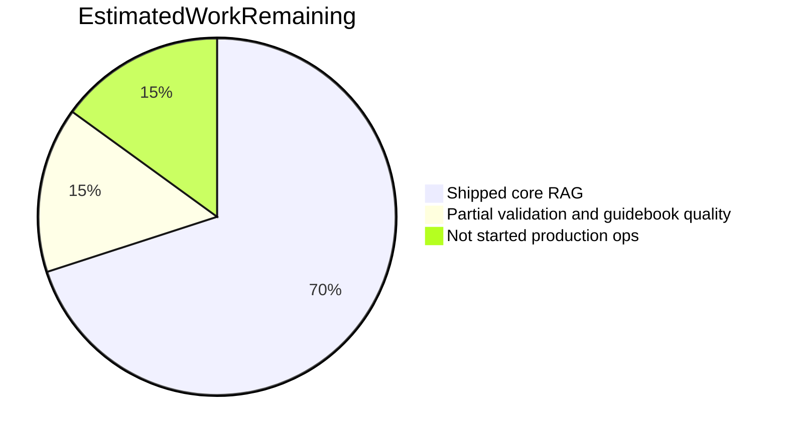
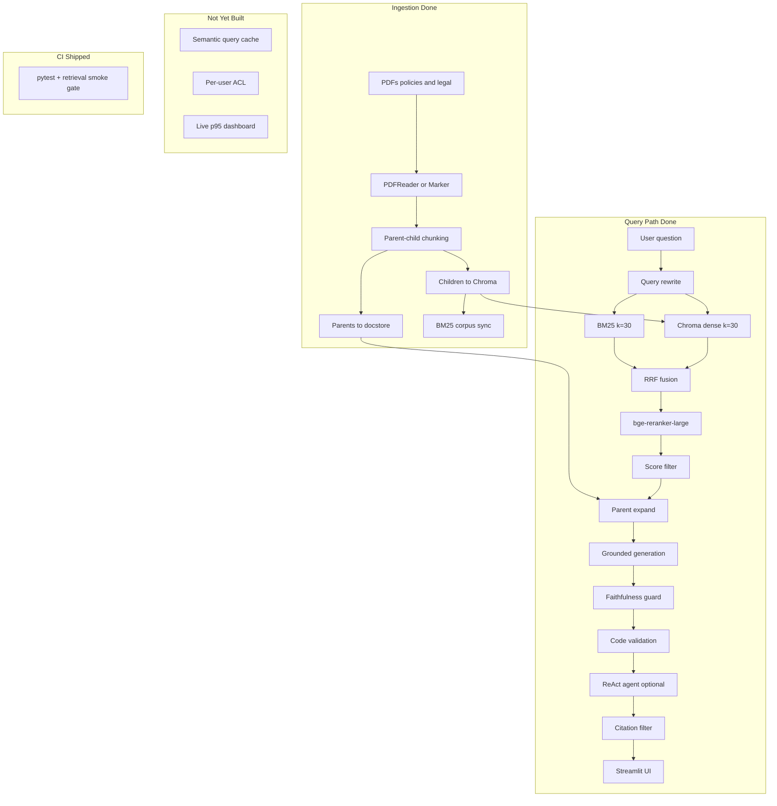

# Company Policy RAG — Project Status Report (README3)

> **README3** is the living progress report for `company_policy_rag`: what is shipped, what is partial, what remains, and what must be validated before calling the system production-ready.
>
> - **Setup & reference:** [README.md](README.md)
> - **Engineering journey & lessons:** [README2.md](README2.md)
> - **This document:** completion status, metrics gap, prioritized backlog

**Report date:** 2026-06-19  
**Index snapshot:** 308 Chroma chunks | 182 tests | 60 golden cases (25 policy + 35 guidebook)

---

## Table of contents

1. [Executive dashboard](#1-executive-dashboard)
2. [Dual phase frameworks](#2-dual-phase-frameworks)
3. [Feature completion matrix](#3-feature-completion-matrix)
4. [Corpus-specific status](#4-corpus-specific-status)
5. [Metrics and validation gap](#5-metrics-and-validation-gap)
6. [Known risks and failure modes](#6-known-risks-and-failure-modes)
7. [Remaining work — prioritized backlog](#7-remaining-work--prioritized-backlog)
8. [Architecture state](#8-architecture-state)
9. [Suggested timeline (30 / 60 / 90 days)](#9-suggested-timeline-30--60--90-days)
10. [Keeping this report current](#10-keeping-this-report-current)

---

## 1. Executive dashboard

### Headline completion

| Lens | Estimate | Rationale |
|------|----------|-----------|
| **Core RAG stack** (ingest → retrieve → generate → cite → UI) | **~85%** | All major modules implemented and tested |
| **5-phase infrastructure roadmap** (Track A) | **~70%** | Phases 1–3 done; Phase 4 CI (tasks 5–6) shipped; tasks 7–8 deferred |
| **Relevancy recovery journey** (Track B) | **~95%** | Phases 1–6 complete per README2 |
| **Production readiness** (CI, monitoring, ACL, validated metrics) | **~55%** | GitHub Actions green (pytest + retrieval smoke); monitoring/ACL still open |

**Bottom line:** P0 validation and guidebook relevancy gate are **complete** on the 308-chunk stack (run `164848`, rel **0.700**). **Phase 4 CI tasks 5–6 validated on GitHub** (run [#27804469869](https://github.com/SoubhagyaJain/Rag-chatbot/actions/runs/27804469869)). Faithfulness prompt tuning (`dd40b86`, run `055058`) did **not** improve aggregate faith (**0.543** vs baseline **0.629**). **Next lever:** retrieval for code/currency cases (`currency_tool_example`, `tools_real_world`).

### Verified system facts (2026-06-19)

| Item | Value | Source |
|------|-------|--------|
| Chroma chunks | **308** (80 policy handbook + 228 guidebook) | `get_collection_stats()` |
| Guidebook `section_path` unknown | **0 / 228 (0%)** — was 111/228 (49%) pre-reindex | Chroma metadata probe post `index_documents.py --force` |
| Guidebook `content_type` mix | prose **114**, code **3**, diagram_caption **111** | Same probe |
| Unit tests | **182** collected | `pytest tests/ --collect-only` |
| Combined golden set | **60 cases** | `data/eval/golden_dataset.json` v2 |
| Guidebook-only golden set | **35 cases** | `golden_dataset_guidebook.json` (project root) |
| Weak-case subset | **10 cases** | `data/eval/golden_subset_weak_guidebook.json` |
| Latest full eval run | `20260618_133725` — **60 cases** | `logs/evaluation_results.json` |
| Guidebook relevancy gate (baseline) | `20260618_164848` — rel **0.700**, faith **0.629** | `logs/evaluation_guidebook_enumeration_tuning.json` |
| Faithfulness tuning eval | `20260619_055058` — rel **0.666**, faith **0.543** | `logs/evaluation_guidebook_faith_tuning.json` — commit `dd40b86` |
| GitHub CI green run | [#27804469869](https://github.com/SoubhagyaJain/Rag-chatbot/actions/runs/27804469869) | `unit-tests` 182/182 + `eval-smoke` PASS |
| CI smoke metrics | hit **1.000**, prec **0.896**, rec **0.667** | 8-case `golden_subset_ci_smoke.json` |
| Historical best (policy, 25 cases) | rel **0.747**, faith **0.807**, prec **0.80** | Run `20260617_104356` |
| E2E latency (CPU, 5-case benchmark) | p50 **53.5s** / p95 **58.8s** | `logs/latency_benchmark.json` |

### Completion breakdown



---

## 2. Dual phase frameworks

**Important:** “Phase N” refers to two different tracks in this project. Always check which track is meant.

### Track A — RAG infrastructure roadmap (5 phases)

Long-horizon capability build for multi-corpus, code-heavy, production-grade RAG.

| Phase | Scope | Status | Key artifacts |
|-------|-------|--------|---------------|
| **1** | Optional Marker PDF parsing; parent-child chunking; code-block protection; diagram caption nodes; golden eval v2 (60 cases) | **Done** | `src/chunking.py`, `src/pdf_parsers.py`, `src/docstore.py`, `src/diagram_captions.py`, `data/eval/golden_dataset.json` |
| **2** | Hybrid BM25 + dense RRF fusion; parent-document retrieval (rank children, expand parents) | **Done** | `src/bm25_index.py`, `src/hybrid_retrieval.py`, `src/parent_retrieval.py`, `src/retriever.py` |
| **3** | Post-generation code validation; self-correct once; low-confidence fallback; eval trace fields | **Done** | `src/code_validation.py`, `src/generation.py` (`GenerationTrace`), `app/streamlit_app.py`, `scripts/analyze_eval_failures.py` |
| **4** | Production reliability layer (proposed) | **Not started** | CI eval gate, semantic query cache, observability export, nightly golden runs |
| **5** | Enterprise hardening (proposed) | **Not started** | Per-user ACL, GPU Docker, Ollama-in-compose, collection sharding |

**Track A progress: 3 / 5 phases complete (60%).**

### Track B — Relevancy recovery journey (README2, 6 phases)

Short-horizon metric recovery after strict-grounding over-abstention regression (relevancy fell to 0.40).

| Phase | Focus | Outcome | Status |
|-------|-------|---------|--------|
| **1** | Faithfulness guard fix | Guard keeps answer on `UNSUPPORTED` in balanced mode; strip double-ending abstention | **Done** |
| **2** | Prompts + query augmentation | Trimmed few-shots; `augment_query_with_policy_terms()` | **Done** |
| **3** | Retrieval depth + judge | `RERANKER_TOP_N=6`; context-aware relevancy judge | **Done** |
| **4** | Normalization + edge cases | `normalize_balanced_answer()`; at-will/disciplinary prompts | **Done** — relevancy **0.747** |
| **5** | Citation precision | Generation-linked sources; `[Source N]` filtering | **Done** — `src/citations.py` |
| **6** | Infra hardening | Mandatory citation tags, Chroma telemetry fix, Streamlit probe, Docker | **Done** |

**Track B progress: 6 / 6 phases complete (100%).** Details and per-case wins: [README2.md](README2.md).

### Phase naming quick reference

| If someone says… | They usually mean… |
|------------------|-------------------|
| “Phase 3 code validation” | **Track A** — `src/code_validation.py` |
| “Phase 3 relevancy judge” | **Track B** — `evaluation.py` judge + `RERANKER_TOP_N=6` |
| “Phase 4” without context | **Ask** — Track A (prod reliability) vs Track B (normalization, run `104356`) |

### Documentation drift (resolved 2026-06-18 session close)

| Doc | Was stale | Now |
|-----|-----------|-----|
| README2.md | “94 tests”, “15-case golden set” | **182 tests**, **60 cases** |
| README.md | “94 tests” in project structure | **182 tests** + CI/smoke section |
| All READMEs | Phase 4 CI “planned” | **Shipped** — see §7 tasks 5–6 |

README3 remains the source of truth for completion status and backlog priority.

---

## 3. Feature completion matrix

Status key: **Done** = implemented + tested | **Partial** = shipped but not fully validated | **Planned** = not implemented

### Ingestion and indexing

| Capability | Status | Notes |
|------------|--------|-------|
| Section-aware chunking (640/480 child, metadata) | **Done** | `src/utils.py`, `src/chunking.py` |
| Incremental indexing (`file_hash`) | **Done** | `scripts/index_documents.py` |
| Chroma persistence + corruption recovery | **Done** | `src/indexing.py` |
| Hierarchical parent-child chunking | **Done** | Parents in `storage/docstore/` |
| Code-block protection (atomic splits) | **Done** | `src/chunking.py` |
| Diagram caption nodes | **Done** | `src/diagram_captions.py` |
| Optional Marker PDF parsing | **Done** (opt-in) | `ENABLE_MARKER_PDF=false` default |
| Guidebook section metadata quality | **Done** | Re-indexed 2026-06-18: 0% `unknown` `section_path`; `content_type` on all chunks |
| Legal PDF upload via Streamlit | **Done** | `src/document_upload.py`, `app/streamlit_app.py` |

### Retrieval

| Capability | Status | Notes |
|------------|--------|-------|
| LLM query rewrite | **Done** | `src/query_processing.py` |
| Policy-term query augmentation | **Done** | Deterministic expansion for edge cases |
| Chroma dense retrieval (k=30) | **Done** | `src/retriever.py` |
| Hybrid BM25 + RRF fusion | **Done** | `src/hybrid_retrieval.py` — on by default |
| Cross-encoder reranker (bge-reranker-large) | **Done** | CPU bottleneck (~58% e2e) |
| Relative score filter | **Done** | `src/postprocessors.py` |
| Parent-document expansion | **Done** | `src/parent_retrieval.py` |
| Metadata ACL filters | **Planned** | Hooks in retriever; not per-user |

### Generation and grounding

| Capability | Status | Notes |
|------------|--------|-------|
| Strict / balanced grounding modes | **Done** | `src/prompts.py` |
| Faithfulness guard (SUPPORTED/UNSUPPORTED) | **Done** | Balanced keeps answer on reject |
| `normalize_balanced_answer()` | **Done** | Strips double-ending abstention |
| Code validation pipeline (Phase 3) | **Done** | Heuristic + LLM judge + self-correct ×1 |
| Low-confidence fallback message | **Done** | Streamlit info banner |
| `GenerationTrace` for eval/debug | **Done** | `src/generation.py` |

### Agent, citations, and UI

| Capability | Status | Notes |
|------------|--------|-------|
| ReAct agent (LlamaIndex 0.14 workflow) | **Done** | `src/agent.py` |
| Session memory (ChatMemoryBuffer) | **Done** | `src/memory.py` |
| Generation-linked citations | **Done** | `SourceTrackingQueryEngine` |
| Mandatory `[Source N]` prompt rules | **Done** | Balanced + agent system prompt |
| Streamlit primary UI | **Done** | Chat, sidebar, legal upload, diagnostics |
| Chainlit legacy UI | **Done** | `app/chat_app.py` — not primary |

### Evaluation and quality gates

| Capability | Status | Notes |
|------------|--------|-------|
| Golden dataset v2 (60 cases) | **Done** | Policy + guidebook |
| Top-level guidebook dataset (35 cases) | **Done** | `golden_dataset_guidebook.json` |
| LLM-as-judge (faithfulness + relevancy) | **Done** | `src/evaluation.py` |
| Phase 3 eval aggregates | **Done** | `code_validation_pass_rate`, `low_confidence_fallback_rate` |
| Failure mode analyzer | **Done** | `scripts/analyze_eval_failures.py` |
| Full 60-case eval on current stack | **Partial** | Last logged `133725`; re-run after major pipeline changes |
| Guidebook-only eval on current stack | **Done** | Runs `164848`, `055058` logged |
| CI eval gate on PR | **Done** | `.github/workflows/rag-ci.yml` green on GH (run `27804469869`) |
| Human-judge agreement study | **Partial** | `scripts/compare_human_judge.py` exists; not run recently |

### Operations and deployment

| Capability | Status | Notes |
|------------|--------|-------|
| Docker (Streamlit + host Ollama) | **Done** | `docker-compose.yml` |
| Chroma telemetry fix | **Done** | `src/chroma_telemetry.py` |
| Index health probe | **Done** | `probe_chroma_index()` |
| Latency benchmark script | **Done** | `scripts/benchmark_latency.py` |
| Per-stage timing (ContextVar) | **Done** | `src/timing.py` |
| Semantic query cache | **Planned** | README roadmap |
| Live-traffic p95 dashboard | **Planned** | Golden-set benchmark only |
| GPU Docker / Ollama-in-compose | **Planned** | CPU default |

---

## 4. Corpus-specific status

### Policy handbook (`data/policies/`)

| Item | Status |
|------|--------|
| Golden cases | **25** in combined set |
| Indexed chunks | **~80** |
| Section metadata | **Strong** — Roman numerals, section paths populated |
| Eval history | **13 runs** logged; best run `20260617_104356` |
| Known weak cases | `remote_work` (retrieval miss), `notice_resignation` (partially improved via at-will mapping) |

**Assessment:** Policy corpus is **stronger** on the current index — rel **0.716** in run `20260618_133725` (25 cases). Known weak cases: `remote_work`, `overtime_pay`, `equal_opportunity`, `whistleblower`, `manager_agent`.

### AI Agents guidebook (`data/legal/AI_Agents_guidebook.pdf`)

| Item | Status |
|------|--------|
| Golden cases | **35** (top-level `golden_dataset_guidebook.json`) |
| Indexed chunks | **228** |
| Query type mix | 12 factual, 6 pattern, 6 workflow, 5 enumeration, 4 code, 2 edge_case |
| Section metadata | **Strong** — 0% `unknown` `section_path` after caption inheritance re-index |
| `content_type` | prose 114, code 3, diagram_caption 111 |
| Eval history | Run `20260618_132316` (35 cases); weak subset `20260618_140509` (10 cases) |
| Phase 3 stress | **High** — code validation pass rate **0%**; fallback rate **14.3%** (baseline) |

**Assessment:** Ingestion metadata is **fixed**. Enumeration tuning raised full-guidebook relevancy **0.629 → 0.700** (`152255` → `164848`); enumeration bucket rel **0.84**, hit **1.00**. Faithfulness prompt tuning (`055058`) did not beat baseline faith **0.629** (aggregate **0.543**). Remaining weak spots: **code** bucket (faith **0.25**, rel **0.325** on `055058`), **currency** retrieval misses (`tools_real_world`, `currency_tool_example`).

### Combined index implications

The production index (`company_policies`, 308 chunks) mixes corpora. Retrieval can pull handbook chunks for guidebook questions and vice versa — by design for a unified assistant, but eval must be run **per corpus** (`--corpus guidebook` / `--corpus policy`) to isolate failure modes.

---

## 5. Metrics and validation gap

This is the **most important section** of README3. Several README claims use historical 15-case metrics that **do not reflect** the current pipeline (hybrid BM25, parent retrieval, code validation) or corpus (guidebook added).

### Targets vs measured (current 308-chunk stack)

| Metric | Target | `164848` baseline | `055058` faith tuning | `160052` enum×5 |
|--------|--------|-------------------|----------------------|-----------------|
| Hit rate | > 0.85 | 0.771 | 0.800 | **1.000** ✓ |
| Context precision | > 0.50 | **0.594** ✓ | **0.625** ✓ | **1.000** ✓ |
| Context recall | > 0.60 | **0.690** ✓ | **0.700** ✓ | **0.933** ✓ |
| Faithfulness | ≥ 0.90 | 0.629 | 0.543 | 0.500 |
| Answer relevancy | ≥ 0.75 | **0.700** ✓ (gate) | 0.666 | **0.840** ✓ |
| Code validation pass rate | ≥ 0.90 | — | **1.000** ✓ | — |
| Low-confidence fallback rate | < 0.05 | **0.000** ✓ | **0.000** ✓ | **0.000** ✓ |
| Enumeration relevancy | ≥ 0.70 | **0.840** ✓ | **0.780** ✓ | **0.840** ✓ |

**Faith tuning (`055058`, commit `dd40b86`):** prompt rules 19b–25 + optional claim-trim guard (`FAITHFULNESS_GUARD_REJECT_ACTION`, default `keep`). Per-case faith vs `164848`: **2 improved / 8 regressed / 25 unchanged**. Win: `manager_agent` faith **1.0**.

**By corpus (full 60-case run `133725`):** policy rel **0.716**, guidebook rel **0.534**, guidebook fallback **11.4%**.

**By query type (guidebook baseline `132316`):** enumeration rel **0.360**, code rel **0.800** / faith **0.625**, factual rel **0.575**.

### Top failure buckets (guidebook `20260618_132316`)

| Bucket | Count | Representative cases |
|--------|-------|----------------------|
| `code_validation_fallback` | **5** | `tools_real_world`, `currency_tool_example`, `tools_block`, `agent_vs_llm_vs_rag`, `workflow_retrieval_step` |
| `low_relevancy` | **18** | `six_building_blocks` (rel 0), `design_patterns_popular`, enumeration cluster |
| `retrieval_miss` | **9** | `role_playing_block` (handbook bleed), `memory_short_long`, `tools_real_world` |
| `low_faithfulness` | **12** | code + pattern cases |
| Cross-corpus bleed | **2+** | `role_playing_block`, `planning_block` — handbook chunks for guidebook Qs |

### Post-reindex weak-subset deltas (`compare_weak_cases.py`)

| Case | Baseline → post | Notes |
|------|-----------------|-------|
| `memory_short_long` | hit 0→1, rel 0→**0.80** | Clear win — section metadata fixed retrieval |
| `six_building_blocks` | rel 0→**0.50** | Improved; still triggers code_validation fallback |
| `custom_tools` | faith 0.50→**1.00** | Faithfulness win |
| `tools_real_world` | unchanged | Still `code_validation` fallback |
| `currency_tool_example` | rel 0.80→0.00 | Regression when fallback removed but answer judged irrelevant |
| `agent_building_blocks_count` | rel 1.00→0.00 | Regression — needs investigation |

**Decision gates — PASSED:**
- Enumeration subset `160052`: rel **0.84**, hit **1.00**
- Full 35-case guidebook `164848`: rel **0.700** (≥ 0.70 gate) — **Phase 4 CI unblocked**

**By query type (`164848`):** factual rel **0.725**, enumeration **0.84**, code **0.525**, pattern **0.75**, workflow **0.567**, edge_case **0.80**.

**By query type (`055058`):** code faith **0.25** / rel **0.325** (worst bucket); pattern faith **0.667**; enumeration rel **0.78**.

### Validation status

| P0 item | Status |
|---------|--------|
| 60-case eval (`20260618_133725`) | **Done** |
| Guidebook eval (`20260618_132316`) | **Done** |
| Failure analysis | **Done** — see buckets above |
| Guidebook re-index (`section_path` + `content_type`) | **Done** — 0% unknown |
| Weak-subset post-reindex eval | **Done** (`20260618_140509`) |
| Full guidebook re-eval post-enumeration (`164848`) | **Done** — rel **0.700**, gate passed |
| Faithfulness prompt tuning (`055058`) | **Done** — no aggregate improvement; see §7 task 16 |
| GitHub CI green run (`27804469869`) | **Done** — billing resolved |

Refresh commands:

```bash
python scripts/analyze_eval_failures.py --results logs/evaluation_guidebook.json --run-id 20260618_132316
python scripts/compare_weak_cases.py
python scripts/evaluate.py --dataset data/eval/golden_subset_weak_guidebook.json --output logs/evaluation_subset_weak.json
```

### What we can claim now

| Claim | Supported? |
|-------|------------|
| “Hybrid BM25 + parent retrieval on 308-chunk index” | **Yes** — eval runs logged |
| “Guidebook section_path metadata fixed” | **Yes** — 0% unknown post-reindex |
| “Code validation pipeline works (unit tests)” | Yes — `tests/test_code_validation.py` |
| “Code validation pass rate ≥ 0.90” | **No** — 0% on all measured runs |
| “Relevancy ≥ 0.75 on production index” | **No** — best full-run 0.610 |
| “Guidebook RAG quality acceptable” | **No** — rel 0.571 baseline, 0.450 weak subset |
| “Faithfulness ≥ 0.90 in balanced mode” | **No** — guidebook **0.629** baseline (`164848`); policy best **0.807** (`104356`) |
| “GitHub Actions CI green” | **Yes** — run `27804469869` (pytest + retrieval smoke) |

---

## 6. Known risks and failure modes

### Risk register

| ID | Risk | Likelihood | Impact | Mitigation |
|----|------|------------|--------|------------|
| R1 | Metrics stale vs current stack | **Low** (was High) | Ship regressions undetected | P0 evals done; monitor with subset + nightly runs |
| R2 | Guidebook retrieval noise (`unknown` sections) | **Low** (was High) | Low precision on agent/code queries | **Mitigated** — re-index 2026-06-18; residual misses are cross-corpus bleed |
| R3 | CPU latency (p95 ~59s) | **High** | Poor UX at scale | GPU reranker, `bge-reranker-base`, query cache |
| R4 | Faithfulness/relevancy trade-off | **Medium** | 0.807 faithfulness at 0.747 relevancy | Tighter generation prompts, not re-enabling guard abstention |
| R5 | Code validation false positives | **High** | Over-use of low-confidence fallback | **Top P3 blocker** — 5 fallbacks on guidebook baseline; 0% pass rate; tune `src/code_validation.py` |
| R6 | Citation score fallback | **Medium** | Wrong sources when tags omitted | Mandatory tags (done); monitor `selection_reason` in logs |
| R7 | Cross-corpus retrieval bleed | **Medium** | Handbook chunks for guidebook Qs | Optional `source_file` metadata filter at query time |
| R8 | Doc drift (README vs reality) | **Low** | Onboarding confusion | Keep README3 current; refresh README2 |

### Expected failure modes by query type (guidebook)

| Query type | Count | Likely failure | Detection signal |
|------------|-------|----------------|------------------|
| `code` | 4 | Hallucinated code lines; validation fallback | `fallback_reason=code_validation` |
| `enumeration` | 5 | Incomplete lists (6 building blocks) | Low relevancy judge score |
| `edge_case` | 2 | Failure to abstain on out-of-doc topics | Non-abstention answer; low faithfulness |
| `workflow` | 6 | Missing orchestration steps | Retrieval miss + low relevancy |
| `pattern` | 6 | Conflation of ReAct vs reflection | Low faithfulness |
| `factual` | 12 | Section miss due to `unknown` metadata | `hit_rate=0` or low precision |

---

## 7. Remaining work — prioritized backlog

### P0 — Validate before new features ✅ Complete (2026-06-18)

| # | Task | Status | Result |
|---|------|--------|--------|
| 1 | Run `python scripts/evaluate.py` (60 cases) | **Done** | `20260618_133725` in `evaluation_results.json` |
| 2 | Run `python scripts/evaluate.py --corpus guidebook` | **Done** | `20260618_132316` in `evaluation_guidebook.json` |
| 3 | Run `analyze_eval_failures.py` on both | **Done** | Top buckets documented in §5 |
| 4 | Fix guidebook `section_path` coverage | **Done** | `--force` re-index; 0% unknown; weak subset `20260618_140509` |

### P1 — Track A Phase 4 (production reliability)

| # | Task | Effort | Success criteria |
|---|------|--------|------------------|
| 5 | CI: `pytest tests/ -q` on every PR | **Done** | `.github/workflows/rag-ci.yml` `unit-tests` job |
| 6 | CI: eval smoke (`--retrieval-only` on 8-case subset) | **Done** | `scripts/ci_eval_gate.py`; baseline hit **1.00** / prec **0.896** / rec **0.75** |
| 7 | Semantic query cache | 1–2 days | Cache hit reduces e2e for repeat queries |
| 8 | Export `src/timing.py` stages to structured logs / dashboard | 1 day | p50/p95 per stage in staging |

### P2 — Track A Phase 5 (enterprise)

| # | Task | Effort | Success criteria |
|---|------|--------|------------------|
| 9 | Per-user ACL metadata filters | 2–3 days | Restrict retrieval by `document_type` / team |
| 10 | GPU reranker Docker variant | 1 day | Rerank stage < 5s p95 |
| 11 | Ollama-in-compose option | 1 day | Fully self-contained `docker compose up` |
| 12 | Collection sharding by department | 2–3 days | Separate Chroma collections |

### P3 — Quality polish (next after P0)

| # | Task | Effort | Success criteria |
|---|------|--------|------------------|
| 13 | Tune code validation (reduce false-positive fallbacks) | **Done** 2026-06-18 | Weak subset `143246`: pass **100%**, fallback **0%**; `answer_only` trigger + `strip_code` fail mode |
| 14 | Corpus-scoped retrieval filter (`source_file` / `document_type`) | **Done** 2026-06-18 | `src/retrieval_scope.py`; eval scopes by case corpus; no handbook bleed on `role_playing_block` |
| 15 | Enumeration prompt / comprehensive-list tuning | **Done** 2026-06-18 | Subset `160052`: enum rel **0.84**; full 35-case `164848`: rel **0.700** (gate passed) |
| 16 | Simultaneous relevancy ≥ 0.75 + faithfulness ≥ 0.90 | **Ongoing** | Prompt tuning `dd40b86` (`055058`): faith **0.543**, rel **0.666** — no gate pass; claim-trim tested, default `keep` |
| 17 | Human-judge overlap (5–10 cases) | 4 hrs | `scripts/compare_human_judge.py` report |
| 18 | Nightly full golden run + trend alert | 1 day | Slack/email on >5% metric drop |
| 19 | Code/currency retrieval boost | 1–2 days | `content_type=code` filter or query augmentation; fix `currency_tool_example`, `tools_real_world` misses |

---

## 8. Architecture state

### Implemented pipeline (today)



### Module map (28 source files)

| Layer | Files | Status |
|-------|-------|--------|
| Config | `config.py` | Done |
| Ingest | `indexing.py`, `chunking.py`, `pdf_parsers.py`, `docstore.py`, `diagram_captions.py`, `document_upload.py`, `pdf_images.py` | Done |
| Retrieve | `retriever.py`, `bm25_index.py`, `hybrid_retrieval.py`, `parent_retrieval.py`, `query_processing.py`, `postprocessors.py` | Done |
| Generate | `generation.py`, `prompts.py`, `code_validation.py`, `language.py` | Done |
| Agent | `agent.py`, `memory.py`, `citations.py` | Done |
| Eval | `evaluation.py`, `human_judge_agreement.py`, `timing.py` | Done |
| Ops | `chroma_telemetry.py`, `cli.py`, `utils.py` | Done |

### Scripts inventory

| Script | Purpose | Status |
|--------|---------|--------|
| `scripts/index_documents.py` | Bulk indexing | Done |
| `scripts/evaluate.py` | Golden-set eval (`--corpus`, `--dataset`) | Done |
| `scripts/analyze_eval_failures.py` | Failure mode report | Done |
| `scripts/benchmark_latency.py` | p50/p95 per stage | Done |
| `scripts/compare_human_judge.py` | Human vs LLM judge | Done, underused |
| `scripts/diagnose_index.py` | Index diagnostics | Done |
| `scripts/extract_golden_candidates.py` | Golden case scaffolding | Done |

---

## 9. Suggested timeline (30 / 60 / 90 days)

| Window | Focus | Deliverables |
|--------|-------|--------------|
| **Days 1–30** | **Done** — validation + CI | Guidebook gate `164848` (rel 0.700); Phase 4 CI green on GH (`27804469869`); faithfulness prompt tuning `dd40b86` attempted |
| **Days 31–60** | Retrieval + faith recovery | Code/currency retrieval fixes; guidebook faith 0.629 → ≥0.75 without relevancy loss; independent judge experiments |
| **Days 61–90** | Phase 4 remainder + Phase 5 | Semantic cache (task 7); timing dashboard (task 8); ACL filter prototype; nightly golden run |

### Decision gates

| Gate | Criteria to pass |
|------|------------------|
| **Internal beta** | 60-case eval logged; no P0 retrieval misses on policy factual cases |
| **Guidebook GA** | Guidebook eval: relevancy ≥ 0.70, code validation pass ≥ 0.85 |
| **Production pilot** | CI gate live on GitHub (**green** run `27804469869`); p95 e2e < 15s (GPU) or documented SLA; ACL for legal vs HR; faithfulness ≥ 0.75 on guidebook |

---

## 10. Keeping this report current

Update README3 when any of the following change:

| Event | What to update |
|-------|----------------|
| Full or corpus eval run | §1 dashboard, §5 metrics table, §4 corpus assessment |
| New phase shipped | §2 Track A table, §3 feature matrix |
| Index rebuild | §1 chunk counts, §4 metadata quality |
| Test count change | §1, §3 |
| New golden cases | §1 case counts, §4 |

### Quick refresh commands

```bash
pytest tests/ --collect-only -q
python -c "from src.indexing import configure_llama_index, get_collection_stats; configure_llama_index(); print(get_collection_stats())"
python -c "import json; d=json.load(open('logs/evaluation_results.json')); r=d['runs'][-1]; print(r['run_id'], r['aggregate'])"
```

### Report history

| Date | Change |
|------|--------|
| 2026-06-18 | Initial README3 — dual phase frameworks, validation debt documented, 308-chunk snapshot |
| 2026-06-18 | P0 complete — baseline evals `132316`/`133725`, guidebook re-index (0% unknown `section_path`), weak subset `140509`, failure buckets in §5 |
| 2026-06-18 | Session close — Phase 4 CI tasks 5–6 (`085d957`); local smoke hit 1.00 / prec 0.896 / rec 0.75; 182 tests; GH Actions blocked on billing |
| 2026-06-19 | CI green on GitHub (`27804469869`); faithfulness tuning `dd40b86` (`055058`); README/HTML refresh |

---

## Summary

| Question | Answer |
|----------|--------|
| **How far have we come?** | Full local RAG stack; Tracks A.1–3 and B.1–6 complete; guidebook rel gate **0.700** (`164848`); Phase 4 CI **green on GitHub**. |
| **How much is left?** | ~20% to production pilot: **code/currency retrieval + faith recovery (P3)**, then cache/dashboard (tasks 7–8), ACL/GPU (P2). |
| **Biggest gap?** | Guidebook faith **0.629** baseline vs **0.90** target; code bucket faith **0.25** on `055058`. |
| **Next action?** | Retrieval tuning for `currency_tool_example` / `tools_real_world`; re-eval guidebook after retrieval fix; keep rel ≥ 0.70. |

For setup and tuning, see [README.md](README.md). For why each decision was made, see [README2.md](README2.md).